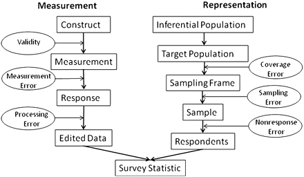

```{r setup, include=FALSE}
knitr::opts_chunk$set(echo = FALSE)
```

## Survey World

Stas Kolenikov 

[StatStas](https://twitter.com/statstas)

Senior Scientist, Abt Associates 

[AbtDataScience](https://twitter.com/abtdatascience)

## Why am I here?

- The Why part: interest in the survey industry, per Dr. Avery's suggestion
- The I part: 
  * experience in both academia (unsuccessful) and industry (current job)
  * past Education Officer of SRMS 
- The here part: local of Columbia, MO
  * convenient to this Survey Research Working Group

## Is there a life outside academia?

(That was a [rhetorical question](https://en.wikipedia.org/wiki/Rhetorical_question) )

## To cover

* Associations
* Skills
* Jobs
* Near future of survey research

## Associations

[American Association for Public Opinion Research](http://www.aapor.org)

[Survey Research Methods Section](http://ww2.amstat.org/sections/srms/)
of the [American Statistical Association](http://www.amstat.org/)

[Association of Academic Survey Research Organizations](https://www.aasro.org/)

Become a member to better understand the landscape of the profession!

## Skills

[Special issue of *Survey Practice*](https://www.surveypractice.org/issue/594)

## Total Survey Error



## Back to skills

- Representation branch: 
[SP paper](https://www.surveypractice.org/article/2855-training-for-the-modern-survey-statistician)
- Measurement branch: 
[SP paper](https://www.surveypractice.org/article/2854-social-science-survey-methodology-training-understanding-the-past-and-assessing-the-present-to-shape-our-future)
- Soft skills: 
[SP paper](https://www.surveypractice.org/article/2856-on-the-job-what-to-expect-and-how-to-succeed)

## Trisector nature of survey research

- Government
- Academia
- Industry

## Survey research: government

- Federal surveys (FSS: [Wikipedia](https://en.wikipedia.org/wiki/Federal_Statistical_System_of_the_United_States),
    [White House archive](https://obamawhitehouse.archives.gov/omb/inforeg_statpolicy/bb-structure-federal-statistical-system))
- State and local government surveys
    * [BRFSS](https://www.cdc.gov/brfss/index.html)
- https://www.usajobs.gov/Search?soc=Survey%20Statisticians

## Survey research: academia

- Academic research centers (most of [AASRO]((https://www.aasro.org/))): serving internal faculty needs
- Mega-centers ([UMich SRC ](http://home.isr.umich.edu/centers/src/)): also serving federal programs

## Survey research: industry

Contractors for government and academia

- Big names
  * [Abt Associates](http://www.abtassociates.com/survey.aspx)
  * [Westat](https://www.westat.com/)
  * [RTI](https://www.rti.org/)
  * [ICF](https://www.icf.com)
  
- Smaller names
  * see some names in [AAPOR Transparency Initiative](https://www.aapor.org/Standards-Ethics/Transparency-Initiative/Current-Members.aspx)

## Survey research: nonprofits and media

- [Pew Research Center](http://www.pewresearch.org/)
- [Kaiser Family Foundation](https://www.kff.org/polling/)
- [Urban Institute](http://urban.org)

## Future

- [SP Paper](https://www.surveypractice.org/article/2857-future-training-of-survey-methodologists)
- [Phone surveys](https://www.aapor.org/Education-Resources/Reports/The-Future-Of-U-S-General-Population-Telephone-Sur.aspx)
are in decline (??)
- [Mobile Technologies](https://www.aapor.org/Education-Resources/Reports/Mobile-Technologies-for-Conducting,-Augmenting-and.aspx)
- Nonprobability surveys 
([AAPOR TF report](https://www.aapor.org/Education-Resources/Reports/Non-Probability-Sampling.aspx), 
[Pew reports](http://www.pewresearch.org/2018/01/26/for-weighting-online-opt-in-samples-what-matters-most/))
- Data Science (whatever it is) and [Big Data](https://www.aapor.org/Education-Resources/Reports/Big-Data.aspx)

## R Markdown

This is an R Markdown presentation. Markdown is a simple formatting syntax for authoring 
HTML, PDF, and MS Word documents. For more details on using R Markdown see http://rmarkdown.rstudio.com.

This presentation is delivered by [shower](https://github.com/shower/shower) HTML presentation engine.

The GitHub repo where this presentation is available at: https://github.com/skolenik/shower-survey-world.
